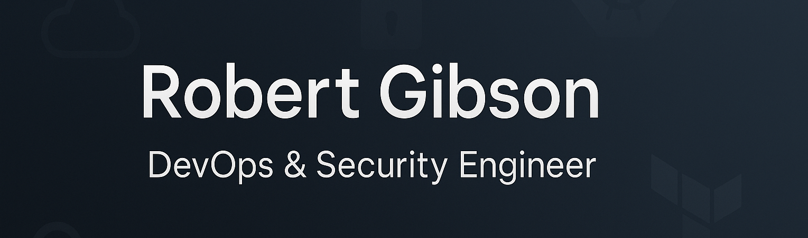

I'm a **DevOps & Security Engineer** passionate about building secure, automated, and scalable cloud-native environments.  
I focus on **Infrastructure as Code (IaC)**, **Kubernetes security**, **cloud compliance**, and **DevSecOps automation**.

---

## 🛠️ Skills & Certifications

---

## 📂 Featured Projects

- 🔒 [**Secure Kubernetes Deployment with Terraform**](https://github.com/boomerg/secure-k8s-deployment)  
   Deploying a hardened Kubernetes cluster with encryption, RBAC, and network policies.
 
 - 🚀 [**DevSecOps CI/CD Pipeline Demo**](https://github.com/boomerg/devsecops-pipeline-demo)  
   End-to-end CI/CD pipeline with container scanning, SAST, DAST integrated.
 
 - ☁️ [**Cloud Compliance Checker (AWS)**](https://github.com/boomerg/cloud-compliance-checker)  
   Automated tool to validate AWS accounts against CIS Benchmarks.

---

## 📈 Current Focus

- Strengthening **multi-cluster Kubernetes security**.
- Scaling **GitOps pipelines** using ArgoCD and Terraform.
- Automating **cloud compliance checks** across Azure environments.

---

## 🌱 2025 Learning Goals

- 🛡️ Earn Certified Kubernetes Administrator (CKA)
- ⚙️ Master advanced Kubernetes networking
- 🧠 Deepen cloud-native threat detection techniques
- ✍️ Publish technical blog posts on DevSecOps practices

---

## 📊 GitHub Stats & Activity

---

## 📫 Let's Connect

- LinkedIn: [linkedin.com/in/rob-gibson7](https://linkedin.com/in/rob-gibson7)

---

> *"Always building. Always securing. Always learning."*
